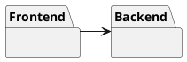
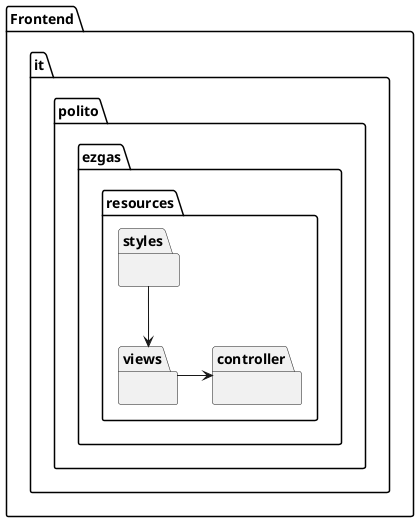
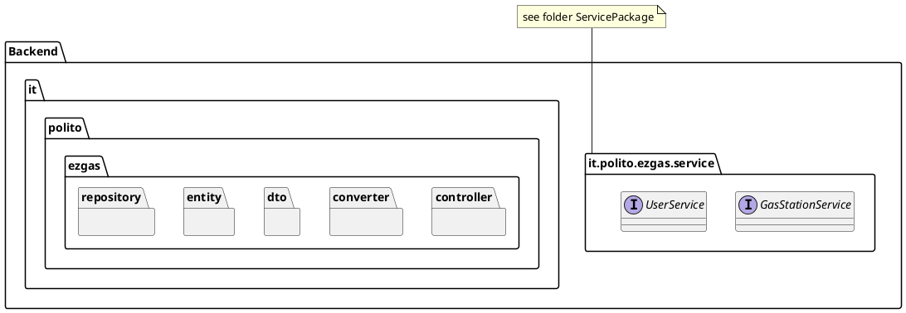

# Design Document

Authors: Davide Battaglia, Andrea Sergio Ferraris, Lorenzo Lanari, Vittorio Pellittieri

Date: 2020-05-16

Version: 1.1

# Contents

- [High level design](#package-diagram)
- [Low level design](#class-diagram)
- [Verification traceability matrix](#verification-traceability-matrix)
- [Verification sequence diagrams](#verification-sequence-diagrams)

# Instructions

The design must satisfy the Official Requirements document (see EZGas Official Requirements.md ). <br>
The design must comply with interfaces defined in package it.polito.ezgas.service (see folder ServicePackage ) <br>
UML diagrams **MUST** be written using plantuml notation.

# High level design

The style selected is client - server. Clients can be smartphones, tablets, PCs.
The choice is to avoid any development client side. The clients will access the server using only a browser.

The server has two components: the frontend, which is developed with web technologies (JavaScript, HTML, Css) and is in charge of collecting user inputs to send requests to the backend; the backend, which is developed using the Spring Framework and exposes API to the front-end.
Together, they implement a layered style: Presentation layer (front end), Application logic and data layer (back end).
Together, they implement also an MVC pattern, with the V on the front end and the MC on the back end.



## Front End

The Frontend component is made of:

Views: the package contains the .html pages that are rendered on the browser and that provide the GUI to the user.

Styles: the package contains .css style sheets that are used to render the GUI.

Controller: the package contains the JavaScript files that catch the user's inputs. Based on the user's inputs and on the status of the GUI widgets, the JavaScript controller creates REST API calls that are sent to the Java Controller implemented in the back-end.



## Back End

The backend  uses a MC style, combined with a layered style (application logic, data).
The back end is implemented using the Spring framework for developing Java Entrerprise applications.

Spring was selected for its popularity and relative simplicity: persistency (M and data layer) and interactions are pre-implemented, the programmer needs only to add the specific parts.

See in the package diagram below the project structure of Spring.

For more information about the Spring design guidelines and naming conventions:  https://medium.com/the-resonant-web/spring-boot-2-0-project-structure-and-best-practices-part-2-7137bdcba7d3



The Spring framework implements the MC of the MVC pattern. The M is implemented in the packages Entity and Repository. The C is implemented in the packages Service, ServiceImpl and Controller. The packages DTO and Converter contain classes for translation services.

**Entity Package**

Each Model class should have a corresponding class in this package. Model classes contain the data that the application must handle.
The various models of the application are organised under the model package, their DTOs(data transfer objects) are present under the dto package.

In the Entity package all the Entities of the system are provided. Entities classes provide the model of the application, and represent all the data that the application must handle.

**Repository Package**

This package implements persistency for each Model class using an internal database.

For each Entity class, a Repository class is created (in a 1:1 mapping) to allow the management of the database where the objects are stored. For Spring to be able to map the association at runtime, the Repository class associated to class "XClass" has to be exactly named "XClassRepository".

Extending class JpaRepository provides a lot of CRUD operations by inheritance. The programmer can also overload or modify them.

**DTO package**

The DTO package contains all the DTO classes. DTO classes are used to transfer only the data that we need to share with the user interface and not the entire model object that we may have aggregated using several sub-objects and persisted in the database.

For each Entity class, a DTO class is created (in a 1:1 mapping).  For Spring the Dto class associated to class "XClass" must be called "XClassDto".  This allows Spring to find automatically the DTO class having the corresponding Entity class, and viceversa.

**Converter Package**

The Converter Package contains all the Converter classes of the project.

For each Entity class, a Converter class is created (in a 1:1 mapping) to allow conversion from Entity class to DTO class and viceversa.

For Spring to be able to map the association at runtime, the Converter class associated to class "XClass" has to be exactly named "XClassConverter".

**Controller Package**

The controller package is in charge of handling the calls to the REST API that are generated by the user's interaction with the GUI. The Controller package contains methods in 1:1 correspondance to the REST API calls. Each Controller can be wired to a Service (related to a specific entity) and call its methods.
Services are in packages Service (interfaces of services) and ServiceImpl (classes that implement the interfaces)

The controller layer interacts with the service layer (packages Service and ServieImpl)
 to get a job done whenever it receives a request from the view or api layer, when it does it should not have access to the model objects and should always exchange neutral DTOs.

The service layer never accepts a model as input and never ever returns one either. This is another best practice that Spring enforces to implement  a layered architecture.

**Service Package**

The service package provides interfaces, that collect the calls related to the management of a specific entity in the project.
The Java interfaces are already defined (see file ServicePackage.zip) and the low level design must comply with these interfaces.

**ServiceImpl Package**

Contains Service classes that implement the Service Interfaces in the Service package.

# Low level design

```plantuml
@startuml

scale max 1024 width
scale max 800 height
skinparam nodesep 10
skinparam ranksep 10

package "Backend" {

    package exception as exception {

        class GPSDataException
        
        class InvalidCarSharingException

        class InvalidGasStationException

        class InvalidGasTypeException

        class InvalidLoginDataException

        class InvalidUserException

        class PriceException

    }

    package "it.polito.ezgas" as ezgas {

        class BootEZGasApplication #71D2D3 {
            + {static} main(args: String [])
            + setupDbWithData()
        }

    }

    package "it.polito.ezgas.controller" as controller {

        class GasStationController {
            + deleteGasStation(gasStationId: Integer)
            + getAllGasStations(): List<GasStationDto>
            + getGasStationById(gasStationId: Integer): GasStationDto
            + getGasStationsByGasolineType(gasolinetype: String): List<GasStationDto>
            + getGasStationsByProximity(myLat: Double, myLon: Double, myRadius: Integer): List<GasStationDto>
            + getGasStationsWithCoordinates(myLat: Double, myLon: Double, myRadius: Integer, gasolinetype: String, carsharing: String): List<GasStationDto>
            + saveGasStation(gasStationDto: GasStationDto)
            + setGasStationReport(priceReportDto: PriceReportDto)
        }

        class HomeController {
            + admin(): String
            + index(): String
            + login(): String
            + map(): String
            + signup(): String
            + update(): String
        }

        class UserController {
            + decreaseUserReputation(userId: Integer): Integer
            + deleteUser(userId: Integer): Boolean
            + getAllUsers(): List<UserDto>
            + getUserByID(userId: Integer): UserDto
            + increaseUserReputation(userId: Integer): Integer
            + login(credentials: IdPw): LoginDto
            + saveUser(userDto: UserDto): UserDto
        }

    }

    package "it.polito.ezgas.converter" as converter {

        class GasStationConverter {
            + {static} toGasStation(gasStationDto: GasStationDto): GasStation
            + {static} toGasStationDto(gasStation: GasStation): GasStationDto
        }

        class LoginConverter {
            + {static} toLoginDto(user: User): LoginDto
        }

        class UserConverter {
            + {static} toUser(userDto: UserDto): User
            + {static} toUserDto(user: User): UserDto
        }

    }

    package "it.polito.ezgas.dto" as dto {

        class GasStationDto {
            -  carSharing: String
            ~ dieselPrice: Double
            ~ gasPrice: Double
            ~ gasStationAddress: String
            ~ gasStationId: Integer
            ~ gasStationName: String
            ~ hasDiesel: boolean
            ~ hasGas: boolean
            ~ hasMethane: boolean
            ~ haPremiumDiesel: boolean
            ~ hasSuper: boolean
            ~ hasSuperPlus: boolean
            ~ lat: double
            ~ lon: double
            ~ methanePrice: Double
            ~ premiumDieselPrice: Double
            ~ reportDependability: double
            ~ reportTimestamp: String
            ~ reportUser: Integer
            ~ superPlusPrice: Double
            ~ superPrice: Double
            + GasStationDto()
            + GasStationDto(gasStationId: Integer,  gasStationName: String,  gasStationAddress: String, hasDiesel: boolean,  hasSuper: boolean,  hasSuperPlus: boolean,  hasGas: boolean,  hasMethane: boolean, hasPremiumDiesel: boolean,  carSharing: String,  lat: double,  lon: double, dieselPrice: Double,  superPrice: Double,  superPlusPrice: Double,  gasPrice: Double,  methanePrice: Double, premiumDieselPrice: Double,  reportUser: Integer,  reportTimestamp: String,  reportDependability: double)
            
            + getCarSharing(): String
            + getDieselPrice(): Double
            + getGasPrice(): Double
            + getGasStationAddress(): String
            + getGasStationId(): Integer
            + getGasStationName(): String
            + getHasDiesel(): boolean
	    + getHasGas(): Boolean
            + getHasMethane(): boolean
            + getHasPremiumDiesel(): boolean
            + getHasSuper(): Boolean
            + getHasSuperPlus(): Boolean
            + getLat(): double
            + getLon(): double
            + getMethanePrice(): Double
            + getPremiumDieselPrice(): Double
            + getReportDependability(): double
            + getReportTimestamp(): String
            + getReportUser(): Integer
            + getSuperPlusPrice(): Double
	    + getSuperPrice(): Double
	    + getUserDto(): UserDto
	    + setCarSharing(carSharing: String)
	    + setDieselPrice(dieselPrice: Double)
	    + setGasPrice(gasPrice: Double)
	    + setGasStationAddress(gasStationAddress: String)
            + setGasStationId(gasStationId: Integer)
	    + setGasStationName(gasStationName: String)
            + setHasDiesel(hasDiesel: boolean)
            + setHasGas(hasGas: boolean)
            + setHasMethane(hasMethane: boolean)
            + setHasPremiumDiesel(hasPremiumDiesel: boolean)
	    + setHasSuper(hasSuper: Boolean)
	    + setHasSuperPlus(hasSuperPlus: Boolean)
	    + setLat(lat: Double)
	    + setLon(lon: Double) 
	    + setMethanePrice(methanePrice: Double)
            + setPremiumDieselPrice(premiumDieselPrice: Double)
            + setReportDependability(reportDependability: double)
	    + setReportTimestamp(reportTimestamp: String) 
            + setReportUser(reportUser: Integer)
            + setSuperPlusPrice(superPlusPrice: Double)
            + setSuperPrice(superPrice: Double)
	    + setUserDto(userDto: UserDto)
        }

        class IdPw {
            - pw: String
            - user: String
            + IdPw()
            + IdPw(id: String, pw: String)
            + getPw(): String
            + getUser(): String
            + setPw(pw: String)
            + setUser(user: String)
        }

        class LoginDto {
            ~ admin: Boolean
            ~ email: String
            ~ reputation: Integer
            ~ token: String
            ~ userId: Integer
            ~ userName: String
            + LoginDto()
            + LoginDto ( userId: Integer,  userName: String,  token: String,  email: String,  reputation: Integer)
            + getAdmin(): Boolean
            + getEmail(): String
            + getReputation(): Integer
            + getToken(): String
            + getUserId(): Integer
            + getUserName(): String
            + setAdmin(admin: Boolean)
            + setEmail(email: String)
            + setReputation(reputation: Integer)
            + setToken(token: String)
            + setUserId(userId: Integer)
            + setUserName(userName: String)
         }

        class PriceReportDto  {
            ~ dieselPrice: Double
            ~ gasPrice: Double
            ~ gasStationId: Integer
            ~ methanePrice: Double
            ~ premiumDieselPrice: Double
            ~ superPlusPrice: Double
            ~ superPrice: Double
            ~ userId: Integer
            + PriceReportDto()
            + PriceReportDto( gasStationId: Integer,  dieselPrice: Double,  superPrice: Double,  superPlusPrice: Double,  gasPrice: Double,  methanePrice: Double,  premiumDieselPrice: Double,  userId: Integer)
            + getDieselPrice(): Double
            + getGasPrice(): Double
	    + getGasStationId(): Integer
            + getMethanePrice(): Double
            + getPremiumDieselPrice(): Double
	    + getSuperPlusPrice(): Double
	    + getSuperPrice(): Double
	    + getUserId(): Integer
	    + setDieselPrice(dieselPrice: Double) 
	    + setGasPrice(gasPrice: Double) 
	    + setGasStationId(gasStationId: Integer)
	    + setMethanePrice(methanePrice: Double)
	    + setPremiumDieselPrice(premiumDieselPrice: Double) 
	    + setSuperPlusPrice(superPlusPrice: Double)
            + setSuperPrice(superPrice: Double)
	    + setUserId(userId: Integer)
         }

         class UserDto {
            ~ admin: Boolean
            ~ email: String
            ~ password: String
            ~ reputation: Integer
            ~ userId: Integer
            ~ userName: String
            + UserDto()
            + UserDto(userId: Integer,  userName: String,  password: String,  email: String,  reputation: Integer)
            + getAdmin(): Boolean
            + getEmail(): String
            + getPassword(): String
            + getReputation() Integer
            + getUserId(): Integer
            + getUserName(): String
            + setAdmin(admin: Boolean)
            + setEmail(email: String)
            + setPassword(password: String)
            + setReputation(reputation: Integer)
            + setUserId(userId: Integer)
            + setUserName(username: String)
        }

    }

    package "it.polito.ezgas.entity" as entit {

        class GasStation {
            - carSharing: String
            - dieselPrice: Double
            - gasPrice: Double
            - gasStationAddress: String  
            - gasStationId: Integer
            - gasStationName: String
            - hasDiesel: boolean
            - hasGas: boolean
            - hasMethane: boolean
            - hasPremimDiesel: boolean
            - hasSuper: boolean
            - hasSuperPlus: boolean
            - lat: double
            - lon: double
            - methanePrice: Double
            - premiumDieselPrice: Double
            - reportDependability: double
            - reportTimestamp: String
            - reportUser: Integer
            - superPlusPrice: Double
            - superPrice: Double
           + GasStation()
           + GasStation( gasStationName: String,  gasStationAddress: String,
					   hasDiesel: boolean,  hasSuper: boolean,  hasSuperPlus: boolean,  hasGas: boolean,  hasMethane: boolean,
					   hasPremiumDiesel: boolean,  carSharing: String,  lat: double,  lon: double,
					   dieselPrice: Double,  superPrice: Double,  superPlusPrice: Double,  gasPrice: Double,  methanePrice: Double,
					   premiumDieselPrice: Double,  reportUser: Integer,  reportTimestamp: String,  reportDependability: double)
            + getCarSharing(): String
            + getDieselPrice(): Double
            + getGasPrice(): Double
            + getGasStationAddress(): String
            + getGasStationId(): Integer
            + getGasStationName(): String
	    + getHasDiesel(): boolean
	    + getHasGas(): boolean
	    + getHasMethane(): boolean
	    + getHasPremiumDiesel(): boolean
            + getHasSuper(): boolean
            + getHasSuperPlus(): boolean
            + getLat(): double
            + getLon(): double
            + getMethanePrice(): Double
            + getPremiumDieselPrice(): Double
            + getReportDependability(): double
            + getReportTimestamp(): String
            + getReportUser(): Integer
            + getSuperPlusPrice(): Double
            + getSuperPrice(): Double
            + getUser(): User
            + setCarSharing(carSharing: String)
            + setDieselPrice(dieselPrice: double)
            + setGasPrice(gasPrice: double)
            + setGasStationAddress(gasStationAddress: String)
            + setGasStationId(gasStationId: Integer)
	    + setGasStationName(gasStationName: String)
            + setHasDiesel(hasDiesel: boolean)
	    + setHasGas(hasGas: boolean)
	    + setHasMethane(hasMethane: boolean)
	    + setHasPremiumDiesel(hasPremiumDiesel: boolean)
	    + setHasSuper(hasSuper: boolean)
	    + setHasSuperPlus(hasSuperPlus: boolean)
	    + setLat(lat: double)
	    + setLon(lon: double)
            + setMethanePrice(methanePrice: Double)
            + setPremiumDieselPrice(premiumDieselPrice: Double)
            + setReportDependability(reportDependability: double)
            + setReportTimestamp(reportTimestamp: String)     
            + setReportUser(reportUser: Integer)   
            + setSuperPlusPrice(superPlusPrice: Double)
	    + setSuperPrice(superPrice: Double)
            + setUser(user: User)
        }

        class PriceReport {
            - dieselPrice: double
            - gasPrice: double
            - priceReportId: Integer
            - superPlusPrice: double
            - superPrice: double
            - user: User
            + PriceReport(user: User,  dieselPrice: double,  superPrice: double,  superPlusPrice: double,  gasPrice: double)
            + getDieselPrice(): double
            + getGasPrice(): double
            + getPriceReportId(): Integer
            + getSuperPrice(): double
            + getSuperPlusPrice(): double
            + getUser(): User
            + setDieselPrice(dieselPrice: double)
            + setGasPrice(gasPrice: double)
            + setPriceReportId(priceReportId: Integer)
            + setSuperPluslPrice(superPlusPrice: double)
            + setSuperPrice(superPrice: double)
            + setUser(user: User)
        }

        class User {
            - admin: Boolean
            - email: String
            - password: String
            - reputation: Integer
            - userId: Integer
            - userName: String
            + User()
            + User(userName: String,  password: String,  email: String,  reputation: Integer)
            + getAdmin(): Boolean
            + getEmail(): String
            + getPassword(): String
            + getReputation(): Integer
            + getUserId(): Integer
            + getUserName(): String
            + setAdmin(admin: Boolean)
            + setEmail(email: String)
            + setPassword(password: String)
            + setReputation(reputation: Integer)
            + setUserId(userId: Integer)
            + setUserName(username: String)
        }

        note "trust_level ranges from -5  to 5" as N1
        N1 .down. User

        note "trust_level ranges from 0 to 100 \ntime_tag is the time when the price list is created" as N2
        N2 .down. PriceReport

    }

    package "it.polito.ezgas.repository" as repository {

        class JpaRepository

        class GasStationRepository

        class PriceReportRepository

        class UserRepository

    }

    package "it.polito.ezgas.service" as service {

        interface "GasStationService" {
            ~ deleteGasStation(gasStationId: Integer): Boolean
            ~ getAllGasStations(): List<GasStationDto>
            ~ getGasStationByCarSharing(carSharing: String): List<GasStationDto>
            ~ getGasStationById(gasStationId: Integer): GasStationDto
            ~ getGasStationsByGasolineType(gasolinetype: String): List<GasStationDto>
            ~ getGasStationsByProximity(lat: double, lon: double): List<GasStationDto>
            ~ getGasStationsByProximity(lat: double, lon: double: radius: int): List<GasStationDto>
            ~ getGasStationsWithCoordinates(lat: double, lon: double, radius: int, gasolinetype: String, carsharing: String): List<GasStationDto>
            ~ getGasStationsWithoutCoordinates(gasolinetype: String, carsharing: String): List<GasStationDto>
            ~ saveGasStation(gasStationDto: GasStationDto): GasStationDto
            ~ setReport(gasStationId: Integer, dieselPrice: Double , superPrice: Double, superPlusPrice: Double, gasPrice: Double, methanePrice: Double,  premiumDieselPrice: Double,  userId: Integer)       
        }    

        interface "UserService" {
            ~ decreaseUserReputation(userId: Integer): Integer
            ~ deleteUser(userId: Integer): Boolean
            ~ getAllUsers(): List<UserDto>
            ~ getUserByID(userId: Integer): UserDto
            ~ increaseUserReputation(userId: Integer): Integer
            ~ login(credentials: IdPw): LoginDto
            ~ saveUser(userDto: UserDto): UserDto
        }

    }

    package "it.polito.ezgas.service.impl" as serviceimpl {

        class GasStationServiceImpl  {
             + addGasStationRepository(gasStationRepository: GasStationRepository)
             + addUserRepository(userRepository: UserRepository)
	     ~ checkGasStationDto(gasStationDto: GasStationDto, checks: String []):  Boolean
	     ~ updateTrustLevel()
        }

        class UserServiceImpl {
            + addUserRepository(userRepository: UserRepository)
            + checkUserDto(userDto: UserDto, checks: String [*]): Boolean
        }

    }

    package "it.polito.ezgas.utils" as utils {

        interface Constants

        class Utils {
            + {static} calculateDistance(lat1: double, lat2: double, lon1: double, lon2: double): double
            - {static} computeObsolescence(today: Date, timeStamp: Date): double
            + {static} computeTrust(gasStation: GasStation): double
            + {static} dayPassed(todayDate: Date,  timeReport: Date): double
            + {static} fromStringToDate( timestamp: String): Date
            + {static} getTodayDate(): Date
            + {static} giveCarSharing(carSharing: String): String
            + {static} isLatLonValid(lat: double, lon: double): boolean
        }

    }

    BootEZGasApplication "1" --> "1" UserRepository

    UserController "1" --> "1" UserService
    GasStationController "1" --> "1" GasStationService

    GasStationServiceImpl "1" --> "1" GasStationRepository
    GasStationServiceImpl "1" --> "1" UserRepository
    UserServiceImpl "1" --> "1" UserRepository

    GasStationRepository "1" --> "*" GasStation
    UserRepository "1" --> "*" User

    service <|.up. serviceimpl

    JpaRepository <|-down- GasStationRepository
    JpaRepository <|-down- PriceReportRepository
    JpaRepository <|-down- UserRepository
    
    GasStationDto "1" --> "1" UserDto
    
    GasStation "1" --> "1" User

}

@enduml
```

# Verification traceability matrix

|             | User   |     Administrator        |  GasStation  |  CarSharingCompany  | PriceList  | GeoPoint  |  Utils    |  
| ----------- | -------|  ----------------------  | ------------ | -------------       | ---------- | --------- | --------- |
|FR1.1        |   X    |          X               |              |                     |            |           |           |
|FR1.2        |   X    |          X               |              |                     |            |           |           |
|FR1.3        |   X    |          X               |              |                     |            |           |           |
|FR1.4        |   X    |          X               |              |                     |            |           |           |        
|FR2          |        |          X               |              |                     |            |           |           |       
|FR3.1        |   X    |          X               |      X       |                     |            |      X    |    X      |
|FR3.2        |   X    |          X               |      X       |                     |            |           |           |
|FR3.3        |   X    |          X               |      X       |                     |            |           |           |        
|FR4.1        |   X    |          X               |      X       |                     |            |     X     |     X     |
|FR4.2        |   X    |          X               |      X       |                     |            |     X     |     X     |
|FR4.3        |   X    |          X               |      X       |                     |     X      |     X     |      X    |
|FR4.4        |   X    |          X               |      X       |                     |     X      |     X     |      X    |
|FR4.5        |   X    |          X               |      X       |        X            |     X      |     X     |     X     |
|FR5.1        |   X    |          X               |      X       |                     |      X     |           |           |
|FR5.2        |   X    |                          |      X       |                     |      X     |           |           |
|FR5.3        |   X    |          X               |      X       |                     |      X     |           |           |

# Verification sequence diagrams

**Scenario 10.1 - Evaluate Price: price is correct**

```plantuml
hide footbox
title EzGas Sequence Diagram - Scenario 10.1

skinparam roundcorner 20

participant ":GUI" as A
participant ":EzGas" as B
participant ":Gas Station" as C
participant ":User" as D


A -> B: "1: searchGasStation()"
activate B
deactivate B
A -> B: 2: priceIsCorrect()
activate B
B -> C: 3: getPriceList()
activate C
deactivate C
B -> D: 4: increaseTrustLevel()
activate D
deactivate D
deactivate B
```

**Scenario 10.2 - Evaluate Price: price is wrong**

```plantuml
hide footbox
title EzGas Sequence Diagram - Scenario 10.2

skinparam roundcorner 20

participant ":GUI" as A
participant ":EzGas" as B
participant ":Gas Station" as C
participant ":User" as D


A -> B: "1: searchGasStation()"
activate B
deactivate B
A -> B: 2: priceIsWrong()
activate B
B -> C: 3: getPriceList()
activate C
deactivate C
B -> D: 4: decreaseTrustLevel()
activate D
deactivate D
deactivate B
```
