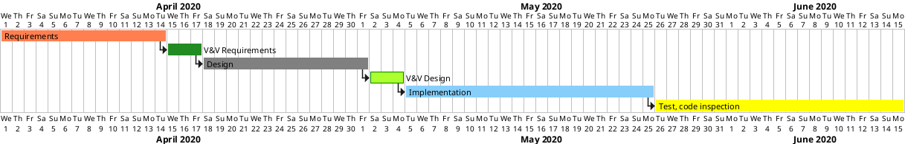

# Project Estimation  

Authors: Davide Battaglia, Andrea Sergio Ferraris, Lorenzo Lanari, Vittorio Pellittieri

Date: 2020-06-14

Version: 1.0 

# Contents

- [Estimate by product decomposition]
- [Estimate by activity decomposition ]

# Estimation approach

<Consider the EZGas  project as described in YOUR requirement document, assume that you are going to develop the project INDEPENDENT of the deadlines of the course>

# Estimate by product decomposition

###

|             | Estimate                        | 
| ----------- | ------------------------------- | 
| NC =  Estimated number of classes to be developed | 30 | 
|  A = Estimated average size per class, in LOC | 60 |
| S = Estimated size of project, in LOC (= NC * A) | 1800 |
| E = Estimated effort, in person hours (here use productivity 10 LOC per person hour)  | 180 |
| C = Estimated cost, in euro (here use 1 person hour cost = 30 euro) | 5400 |
| Estimated calendar time, in calendar weeks (Assume team of 4 people, 8 hours per day, 5 days per week ) | 10 |

# Estimate by activity decomposition

###

|  Activity name | Estimated effort (person hours) | 
| ----------- | ------------------------------- |
| Requirements | 30 |
| V&V Requirements | 10 |
| Design | 30 |
| V&V Design | 10 |
| Implementation | 45 |
| Test, code inspection | 55 |

###

