# Integration and API Test Documentation

Authors: Davide Battaglia, Andrea Sergio Ferraris, Lorenzo Lanari, Vittorio Pellittieri

Date: 2020-05-25

Version: 1.0

# Contents

- [Dependency graph](#dependency graph)

- [Integration approach](#integration)

- [Tests](#tests)

- [Scenarios](#scenarios)

- [Coverage of scenarios and FR](#scenario-coverage)
- [Coverage of non-functional requirements](#nfr-coverage)

# Dependency graph

```plantuml
@startuml

scale max 2048 width
scale max 1600 height
skinparam nodesep 10
skinparam ranksep 10

package "Backend" {

    package "it.polito.ezgas.controller" as controller {

        class GasStationController {
            + getGasStationById(gasStationId: Integer): GasStationDto
            + getAllGasStations(): GasStationDto [*]
            + saveGasStation(gasStationDto: GasStationDto)
            + deleteGasStation(gasStationId: Integer)
            + getGasStationsByGasolineType(gasolinetype: String): GasStationDto [*]
            + getGasStationsByProximity(myLat: Double, myLon: Double): GasStationDto [*]
            + getGasStationsWithCoordinates(myLat: Double, myLon: Double, gasolinetype: String, carsharing: String): GasStationDto [*]
            + setGasStationReport(gasStationId: Integer, dieselPrice: Double , superPrice: Double, superPlusPrice: Double, gasPrice: Double, methanePrice: Double, userId: Integer)
        }

        class HomeController {
            + admin(): String
            + index(): String
            + map(): String
            + login(): String
            + update(): String
            + signup(): String
        }

        class UserController {
            + getUserByID(userId: Integer): UserDto
            + getAllUsers(): UserDto [*]
            + saveUser(userDto: UserDto): UserDto
            + deleteUser(userId: Integer): Boolean
            + increaseUserReputation(userId: Integer): Integer
            + decreaseUserReputation(userId: Integer): Integer
            + login(credentials: IdPw): LoginDto
        }

    }

    package "it.polito.ezgas.converter" as converter {

        class GasStationConverter {
            + {static} toGasStationDto(gasStation: GasStation): GasStationDto
            + {static} toGasStation(gasStationDto: GasStationDto): GasStation
        }

        class LoginConverter {
            + {static} toLoginDto(user: User): LoginDto
        }

        class UserConverter {
            + {static} toUserDto(user: User): UserDto
            + {static} toUser(userDto: UserDto): User
        }

    }

    package "it.polito.ezgas.dto" as dto {

        class GasStationDto {
            ~ gasStationId: Integer
            ~ gasStationName: String
            ~ gasStationAddress: String
            ~ carSharing: String
            ~ lat: Double
            ~ lon: Double
            ~ dieselPrice: Double
            ~ superPrice: Double
            ~ superPlusPrice: Double
            ~ gasPrice: Double
            ~ methanePrice: Double
            ~ reportUser: Integer
            ~ reportTimestamp: String
            ~ reportDependability: Double
            ~ priceReportDtos: PriceReportDto [*]
            + setters() and getters()
        }

        class IdPw {
            - user: String
            - pw: String
            + setters() and getters()
        }

        class LoginDto {
            ~ userId: Integer
            ~ userName: String
            ~ token: String
            ~ email: String
            ~ reputation: Integer
            ~ admin: Boolean
            + setters() and getters()
         }

        class PriceReportDto #DDDDDD {
            ~ priceReportId: Integer
          ~ user: User
          ~ dieselPrice: Double
          ~ superPrice: Double
          ~ superPlusPrice: Double
          ~ gasPrice: Double
            + getPriceReportId(): Integer
            + setters() and getters()
         }

         class UserDto {
            ~ userId: Integer
            ~ userName: String
            ~ password: String
            ~ email: String
            ~ reputation: Integer
            ~ admin: Boolean
            + setters() and getters()
        }

    }

    package "it.polito.ezgas.entity" as entit {

        class GasStation {
            - gasStationId: Integer
            - gasStationName: String
            - gasStationAddress: String
            - carSharing: String
            - lat: Double
            - lon: Double
            - dieselPrice: Double
            - superPrice: Double
            - superPlusPrice: Double
            - gasPrice: Double
            - methanePrice: Double
            - reportUser: Integer
            - reportTimestamp: String
            - reportDependability: Double
            - user: User
            + setters() and getters()
        }

        class PriceReport #DDDDDD {
            - priceReportId: Integer
            - user: User
            - dieselPrice: Double
            - superPrice: Double
            - superPlusPrice: Double
            - gasPrice: Double
            + setters() and getters()
        }

        class User {
            - userId: Integer
            - userName: String
            - password: String
            - email: String
            - reputation: Integer
            - boolean: admin
            + setters() and getters()
        }


    }

    package "it.polito.ezgas.repository" as repository {

        class JpaRepository

        class GasStationRepository

        class PriceReportRepository #DDDDDD

        class UserRepository

    }

    package "it.polito.ezgas.service" as service {

        interface "GasStationService" {
            ~ etGasStationById(gasStationId: Integer): GasStationDto
            ~ saveGasStation(gasStationDto: GasStationDto): GasStationDto
            ~ getAllGasStations(): GasStationDto [*]
            ~ deleteGasStation(gasStationId: Integer): Boolean
            ~ getGasStationsByGasolineType(gasolinetype: String): GasStationDto [*]
            ~ getGasStationsByProximity(lat: Double, lon: Double): GasStationDto [*]
            ~ getGasStationsWithCoordinates(lat: Double, lon: Double, gasolinetype: String, carsharing: String): GasStationDto [*]
            ~ getGasStationsWithoutCoordinates(gasolinetype: String, carsharing: String): GasStationDto [*]
            ~ setReport(gasStationId: Integer, dieselPrice: Double , superPrice: Double, superPlusPrice: Double, gasPrice: Double, methanePrice: Double, userId: Integer)
            ~ getGasStationByCarSharing(carSharing: String): GasStationDto [*]
        }

        interface "UserService" {
            ~ getUserByID(userId: Integer): UserDto
            ~ saveUser(userDto: UserDto): UserDto
            ~ getAllUsers(): UserDto [*]
            ~ deleteUser(userId: Integer): Boolean
            ~ login(credentials: IdPw): LoginDto
            ~ increaseUserReputation(userId: Integer): Integer
            ~ decreaseUserReputation(userId: Integer): Integer
        }

    }

    package "it.polito.ezgas.service.impl" as serviceimpl {

        class GasStationServiceImpl  {
       ~ checkGasStationDto(gasStationDto: GasStationDto, checks: String [*]):  Boolean
        }

        class UserServiceImpl {
            ~ checkUserDto(userDto: UserDto, checks: String [*]): Boolean
        }

    }

    package "it.polito.ezgas.utils" as utils {

        interface Constants

        class Utils {
            + {static} calculateDistance(lat1: Double, lat2: Double, lon1: Double, lon2: Double): Double
            + {static} isLatLonValid(lat: Double, lon: Double) : Boolean
        }

    }

    GasStationController..>GasStationService
    UserController..>UserService
    GasStationService..>GasStation
    GasStationService..>GasStationDto
    GasStationService..>GasStationRepository
    GasStationService..>GasStationConverter
    GasStationService..>Utils
    GasStationServiceImpl..>GasStationDto
    UserService..>User
    UserService..>UserDto
    UserService..>UserRepository
    UserService..>UserConverter
    UserService..>LoginDto
    UserService..>LoginConverter
    UserService..>IdPw
    UserServiceImpl..>UserDto
    GasStationConverter..>GasStation
    GasStationConverter..>GasStationDto
    UserConverter..>User
    UserConverter..>UserDto
    LoginConverter..>LoginDto
    LoginConverter..>User

}

@enduml
```

# Integration approach

    <Write here the integration sequence you adopted, in general terms (top down, bottom up, mixed) and as sequence
    (ex: step1: class A, step 2: class A+B, step 3: class A+B+C, etc)>
    <The last integration step corresponds to API testing at level of Service package>
    <Tests at level of Controller package will be done later>

#  Tests

   <define below a table for each integration step. For each integration step report the group of classes under test, and the names of
     JUnit test cases applied to them>

## Step 1
| Classes  | JUnit test cases |
|--|--|
|GasStationConverter|TestGasStationConverter.class|
|UserConverter|TestUserConverter.class|

## Step 2
| Classes  | JUnit test cases |
|--|--|
|GasStationServiceimpl.getGasStationById( ) |TestGetGasStationById.class|
|GasStationServiceimpl.saveGasStation( ) |TestSaveGasStation.class|
|GasStationServiceimpl.getAllGasStation( ) |TestGetAllGasStation.class|
|GasStationServiceimpl.deleteGasStation( ) |TestDeleteGasStation.class|
|GasStationServiceimpl.getGasStationByGasolineType( ) |TestGetGasStationByGasolineType.class|
|GasStationServiceimpl.getGasStationByProximity( ) |TestGetGasStationByProximity.class|
|GasStationServiceimpl.getGasStationWithCoordinates( ) |TestGetGasStationWithCoordinates.class|
|GasStationServiceimpl.getGasStationWithoutCoordinates( ) TtestGetGasStationWithoutCoordinates.class|
|GasStationServiceimpl.setReport( ) |TestSetReport.class|
|GasStationServiceimpl.getGasStationByCarSharing( ) |TestGetGasStationByCarSharing.class|
|Utils.computeTrust()|TestComputeTrust() |
|Utils.giveCarSharing()|TestGiveCarSharing()|
|UserServiceimpl.testCheckUserDto.java()|TestCheckUserDto.class|
|UserServiceimpl.testIncreaseUserReputation.java()|TestIncreaseUserReputation.class|
|UserServiceimpl.testDecreaseUserReputation.java()|TestDecreaseUserReputation.class|
|UserServiceimpl.testLogin.java()|TestLogin.class|
|UserServiceimpl.testDeleteUser.java()|TestDeleteUser.class|
|UserServiceimpl.testSaveUser.java()|TestSaveUser.class|
|UserServiceimpl.testGetAllUser.java()|TestGetAllUser.class|
|UserServiceimpl.testUserConverter.java()|TestUserConverter.class|
|UserServiceimpl.testGetUserById.java()|TestGetUserById.class|

## Step n API Tests

   <The last integration step  should correspond to API testing, or tests applied to all classes implementing the APIs defined in the Service package>

| Classes  | JUnit test cases |
|--|--|
| GasStationController | TestGasStationController |
| UserController | TestUserController |

# Scenarios

<If needed, define here additional scenarios for the application. Scenarios should be named
 referring the UC they detail>

## Scenario UC11.1 - Get gas stations near User

| Scenario |  name |
| ------------- |:-------------:|
|  Precondition     | User U exists |
|  Post condition     | Gas Station  list G is created  |
| Step#        | Description  |
|  1     |  The User U searches the Gas Stations near him |
|  2     |  The app gets his/her coordinates |
|  3     |  The User U receives a List of Gas Stations near him |

## Scenario UC11.2 - Get gas stations around a given point

| Scenario |  name |
| ------------- |:-------------:|
|  Precondition     | User U exists |
|  Post condition     | Gas Station  list G is created  |
| Step#        | Description  |
|  1     |  The User U searches the Gas Stations in an area |
|  2     |  The app gets the coordinates of that area |
|  3     |  The User U receives a List of Gas Stations in the area|

## Scenario UC12 - Get gas station filtered by Gas Type and Car Sharing

| Scenario |  name |
| ------------- |:-------------:|
|  Precondition     | User U exists |
|  Post condition     | Gas Station  list G is created  |
| Step#        | Description  |
|  1     |  The User U searches the Gas Stations inserting preferences according to Fuel Type and Car Sharing|
|  2     |  The User U receives a List of Gas Stations near him |

# Coverage of Scenarios and FR

<Report in the following table the coverage of  scenarios (from official requirements and from above) vs FR.
Report also for each of the scenarios the (one or more) API JUnit tests that cover it. >

| Scenario ID | Functional Requirements covered | JUnit  Test(s) |
| ----------- | ------------------------------- | ----------- |
| UC1 | FR1.1 | TestSaveUser |
| UC2 | FR1.1 | TestSaveUser |
| UC3 | FR1.2 | TestDeleteUser |
|   -    | FR1.3 | TestGetAllUser |
|   -    | FR1.4 | TestGetUserById |
|   -    | FR2    | TestLogin |
| UC4 | FR3.1 | TestSaveGasStation |
| UC5 | FR3.1 | TestSaveGasStation |
| UC6 | FR3.2 | TestDeleteGasStation |
|   -     | FR3.3 | TestGetAllGasStations |
|   -     | FR4 | TestGetGasStationsById |
|   UC11.1   UC11.2     | FR4.1 | TestGetGasStationsByProximity |
| UC8 | FR4.3 | TestGetGasStationWithCoordinates   TestGetGasStationWithoutCoordinates |
|   -     | FR4.4 | TestGetGasStationWithCoordinates   TestGetGasStationWithoutCoordinates |
|   UC12     | FR4.5 | TestGetGasStationWithCoordinates   TestGetGasStationWithoutCoordinates|
| UC7 | FR5.1 | TestSetReport |
| UC9 | FR5.2 | TestIncreaseUserReputation   TestDecreaseUserReputation |
| UC10 | FR5.3 |  |

# Coverage of Non Functional Requirements

<Report in the following table the coverage of the Non Functional Requirements of the application - only those that can be tested with automated testing frameworks.>

###

| Non Functional Requirement | Test name |
| -------------------------- | --------- |
|                            |           |
