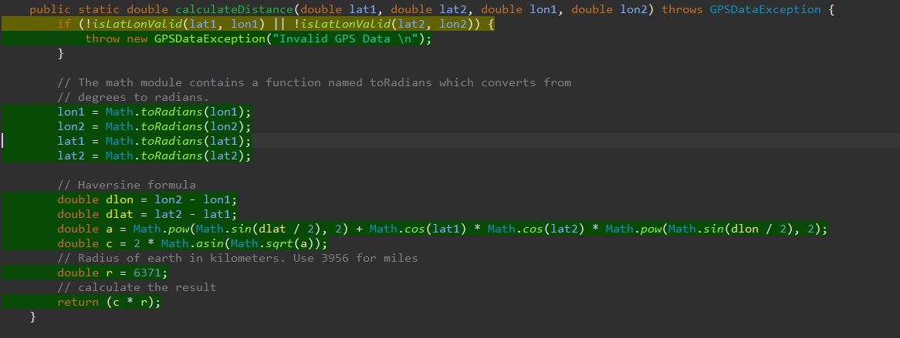
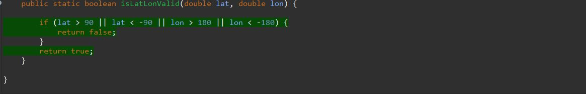

# Unit Testing Documentation

Authors:

Date:

Version:

# Contents

- [Black Box Unit Tests](#black-box-unit-tests)

- [White Box Unit Tests](#white-box-unit-tests)

# Black Box Unit Tests

    <Define here criteria, predicates and the combination of predicates for each function of each class.
    Define test cases to cover all equivalence classes and boundary conditions.
    In the table, report the description of the black box test case and (traceability) the correspondence with the JUnit test case writing the
    class and method name that contains the test case>
    <JUnit test classes must be in src/test/java/it/polito/ezgas   You find here, and you can use,  class EZGasApplicationTests.java that is executed before
    the set up of all Spring components
    >

 ### **Class *Utils* - method *calculateDistance()***
Class Utils - calculateDistance()

**Criteria for method *name*:**

 - Range of value for Latitude
 - Range of value for Longitude

**Predicates for method *name*:**

| Criteria | Predicate |
| -------- | --------- |
|     Range of value  for Latitude   |     >=-90  && <=90      |
|          |      <-90     |
|          |      >90     |
|     Range of value  for Longitude     |      >=-180  && <=180     |
|          |      <-180     |
|          |      >180    |

**Boundaries**:

| Criteria | Boundary values |
| -------- | --------------- |
|    Range of value  for Longitude      |       [mindouble,-90) , [-90,90] , (90,maxdouble]       |
|    Range of value  for Longitude      |       [mindouble,-180) , [-180,180] , (180,maxdouble]   |

**Combination of predicates**:

| Range Latitude | Range Longitude |  Valid / Invalid | Description of the test case | JUnit test case |
|-------|-------|-------|-------|-------|
|<-90            |-                |Invalid           |                              |      testDistance5(-90.1 , 90.1, 180.1 , -180.1)->GPSDataException           |
|>=-90  && <=90  |<-180            |Invalid           |                              |        testDistance6(89 ,53 , -180.1 , 1)->GPSDataException         |
|-               |>180             |Invalid           |                              |      testDistance4(89 ,53 ,180.1 ,1) ->GPSDataException          |  
|-               |>=-180  && <=180 |Valid             |First test two different points --> distance>0, Second test same point--> distance = 0                            |testDistance1(53.32,53.31,-1,79,-1,69)-> 2.0  testDistance2(53.32,53.32,1,1)-> 0 |
|>90             |     -           |Invalid           |                              |      testDistance3(90.1, 53 ,20, 1)->GPSDataException           |

### **Class *Utils* - method *isLatLonValid()***

**Criteria for method *name*:**

- Range of value for Latitude
- Range of value for Longitude

**Predicates for method *name*:**

| Criteria | Predicate |
| -------- | --------- |
|     Range of value  for Latitude   |     >=-90  && <=90      |
|          |      <-90     |
|          |      >90     |
|     Range of value  for Longitude     |      >=-180  && <=180     |
|          |      <-180     |
|          |      >180    |

**Boundaries**:

| Criteria | Boundary values |
| -------- | --------------- |
|    Range of value  for Longitude      |       [mindouble,-90) , [-90,90] , (90,maxdouble]       |
|    Range of value  for Longitude      |       [mindouble,-180) , [-180,180] , (180,maxdouble]   |

**Combination of predicates**:

| Range Latitude | Range Longitude |  Valid / Invalid | Description of the test case | JUnit test case |
|-------|-------|-------|-------|-------|
|<-90            |-                |Invalid           |               |testIsLatLonValid2(-91,150)->false |
|>=-90  && <=90  |<-180            |Invalid           |               |testIsLatLonValid4(50,-190)->false |
|-               |>180             |Invalid           |               |testIsLatLonValid3(50,190)->false  |  
|-               |>=-180  && <=180 |Valid             |               |testIsLatLonValid6(50,150)->true   |
|>90             |     -           |Invalid           |               |testIsLatLonValid1(91,150)->false  |

# White Box Unit Tests

### Test cases definition

    <JUnit test classes must be in src/test/java/it/polito/ezgas>
    <Report here all the created JUnit test cases, and the units/classes under test >
    <For traceability write the class and method name that contains the test case>

| Unit name | JUnit test case |
|--|--|
|Utils  calculateDistance|testDistance|
|Utils isLatLonValid| testIsLatLonValid|

### Code coverage report

    <Add here the screenshot report of the statement and branch coverage obtained using
    the Eclemma tool. >

  Test Coverage for calculateDistance

  Test Coverage for isLatLonValid

### Loop coverage analysis

    <Identify significant loops in the units and reports the test cases
    developed to cover zero, one or multiple iterations >

There are no loops in these functions.

|Unit name | Loop rows | Number of iterations | JUnit test case |
|---|---|---|---|
|||||
|||||
||||||
